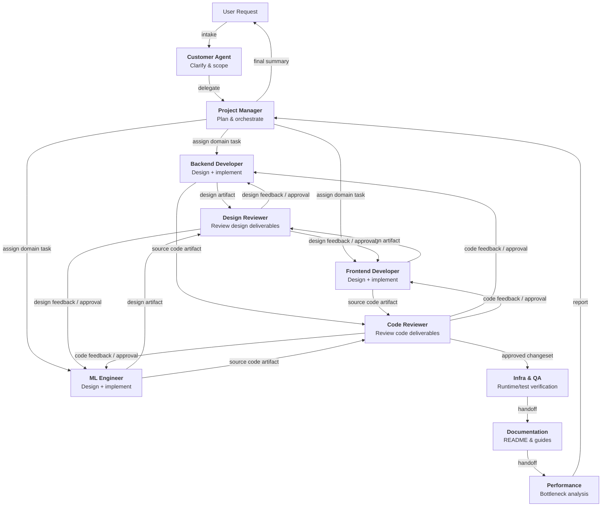

# copilot-assets

GitHub Copilot agent orchestration framework for standardized, multi-role AI-driven development workflows.

## Table of Contents
- [Overview](#overview)
- [Architecture](#architecture)
- [Agents](#agents)
- [Skills](#skills)
- [Integration Guide](#integration-guide)
- [Workflow Example](#workflow-example)
- [Development](#development)
- [License](#license)

---

## Overview

**Purpose**

This repository standardizes GitHub Copilot agent orchestration so that teams can run consistent, auditable, and reusable multi-agent development workflows.

The framework emphasizes:

- **Clear ownership**: each specialist agent owns domain work.
- **Deliverable-driven reviews**: specialist outputs are reviewed as explicit artifacts.
- **Sequential traceability**: task states and handoffs are controlled through task management.
- **Portability**: agents and skills are designed for easy reuse in other repositories.

**Core operating model**

1. Customer captures and clarifies the request.
2. Project Manager decomposes work and assigns owners.
3. Backend Developer, Frontend Developer, and ML Engineer each produce:
   - design artifacts
   - implementation artifacts (source code)
4. Design Reviewer reviews design artifacts.
5. Code Reviewer reviews source code artifacts.
6. Infra & QA, Documentation, and Performance complete downstream validation and readiness checks.

This structure keeps design and implementation ownership with domain specialists, while assigning quality gates to dedicated reviewers.

---

## Architecture

### Agent Orchestration Flow



### Directory Structure

```text
copilot-assets/
├── agents/
│   ├── customer.agent.md
│   ├── project-manager.agent.md
│   ├── design-reviewer.agent.md
│   ├── backend-developer.agent.md
│   ├── frontend-developer.agent.md
│   ├── ml-engineer.agent.md
│   ├── infra-qa.agent.md
│   ├── code-reviewer.agent.md
│   ├── documentation.agent.md
│   └── performance.agent.md
├── skills/
│   ├── task-management/
│   │   └── SKILL.md
│   ├── git-operations/
│   │   └── SKILL.md
│   ├── design-review/
│   │   └── SKILL.md
│   ├── code-review/
│   │   └── SKILL.md
│   └── ...
└── README.md
```

---

## Agents

Each agent is defined in `agents/*.agent.md` with explicit scope, responsibilities, constraints, and output format.

### Customer Agent
- **When to use**: Requirement intake and clarification.
- **Role**: Convert user intent into implementation-ready tasks.
- **Constraint**: No direct implementation.

### Project Manager Agent
- **When to use**: Multi-domain orchestration and sequencing.
- **Role**: Assign owners, enforce one active `in_progress` task, validate `done_criteria`.
- **Policy**: Task order is adjusted by dependency and risk.
- **Default representative implementation order**: Backend → Frontend → ML.

### Backend Developer Agent
- **When to use**: Backend/API/model changes.
- **Role**: Own backend **design and implementation**.
- **Primary deliverables**: Backend design artifacts and backend source code.

### Frontend Developer Agent
- **When to use**: UI/template/CSS/JS changes.
- **Role**: Own frontend **design and implementation**.
- **Primary deliverables**: Frontend design artifacts and frontend source code.

### ML Engineer Agent
- **When to use**: Training/inference/data pipeline changes.
- **Role**: Own ML **design and implementation**.
- **Primary deliverables**: ML design artifacts and ML source code.

### Design Reviewer Agent
- **When to use**: Review design artifacts from Backend/Frontend/ML.
- **Role**: Evaluate boundaries, contracts, quality attributes, and readiness using the design-review skill.
- **Constraint**: Does not implement feature code.

### Code Reviewer Agent
- **When to use**: Review source code artifacts from Backend/Frontend/ML before merge.
- **Role**: Evaluate correctness, regression risk, security, and test adequacy using the code-review skill.
- **Constraint**: Does not implement feature code.

### Infra & QA Agent
- **When to use**: Environment, runtime, and test strategy validation.
- **Role**: Verify deploy/runtime assumptions and test execution feasibility.

### Documentation Agent
- **When to use**: README and developer guide updates.
- **Role**: Keep documentation aligned with implemented behavior.

### Performance Agent
- **When to use**: Bottleneck analysis and optimization.
- **Role**: Provide measurable performance findings and trade-offs.

---

## Skills

Skills are reusable operational procedures defined in `skills/*/SKILL.md`.

### Task Management Skill
- Queue decomposition and assignment
- Ownership transitions (`todo`, `in_progress`, `blocked`, `done`)
- Single active `in_progress` enforcement

### Git Operations Skill
- Safe daily Git operations
- Branching, commit hygiene, sync, conflict handling, rollback guidance

### Design Review Skill
- Architecture and design quality checks
- Severity-classified findings and decision recommendation

### Code Review Skill
- Source code quality and release safety checks
- Severity-classified findings and merge readiness

---

## Integration Guide

### Quick Start: Add as Git Submodule under `.github`

In your target repository:

```bash
git submodule add https://github.com/your-org/copilot-assets.git .github
git submodule update --init --recursive
```

### Reference Agents and Skills

Use the submodule paths directly:

- Agents: `.github/agents/`
- Skills: `.github/skills/`

### Example Target Structure

```text
your-project/
├── .github/
│   ├── agents/
│   ├── skills/
│   ├── README.md
│   ├── tasks/
│   │   ├── current.yaml
│   │   └── archive/
│   ├── copilot-instructions.md
│   └── CONVENTIONS.md
├── src/
└── ...
```

### `current.yaml` Operation Rules

- Project Manager creates one `current.yaml` per requirement.
- Root-level requirement completion uses `completion_condition_for_requirement` only.
- Task-level completion uses each task's `done_criteria`.
- Every task must define `branch_name` for branch-per-task delivery.
- When all tasks are done and requirement completion condition is satisfied, move `current.yaml` to `tasks/archive/`.
- Start from `skills/task-management/current.template.yaml` when bootstrapping a new requirement file.

### `current.yaml` Field Reference

#### Root Keys

| Key | Type | Required | Description |
| --- | --- | --- | --- |
| `request_id` | string | yes | Unique requirement identifier. |
| `requirement_summary` | string | yes | Short summary of the requirement scope and intent. |
| `created_at` | string (ISO 8601) | yes | Requirement file creation timestamp. |
| `updated_at` | string (ISO 8601) | yes | Last update timestamp for the requirement file. |
| `completion_condition_for_requirement` | array of string | yes | Requirement-level completion conditions. This is the only root completion key. |
| `tasks` | array of object | yes | Ordered task list for sequential execution and handoff. |

#### Task Keys (`tasks[]`)

| Key | Type | Required | Description |
| --- | --- | --- | --- |
| `task_id` | string | yes | Unique task identifier inside the requirement. |
| `title` | string | yes | Human-readable task name. |
| `owner` | string | yes | Responsible agent for execution. |
| `status` | enum | yes | Task state: `todo`, `in_progress`, `blocked`, `done`. |
| `handoff_to` | string | yes | Next owner after task completion. |
| `branch_name` | string | yes | Dedicated branch name for branch-per-task development. |
| `inputs` | object | yes | Structured task context (objective, scope, constraints, expected output, acceptance). |
| `done_criteria` | array of string | yes | Task-level completion criteria used for status transition to `done`. |
| `blockers` | object | yes | Blocking conditions that prevent normal task progress and require explicit tracking until unblocked. |

#### Blocker Definition and Fields

A blocker is not just a delay. It is a condition that prevents the owner from making meaningful forward progress under current constraints. If a blocker exists and no immediate workaround is available, task `status` should be set to `blocked`.

| Field | Type | Required | Description |
| --- | --- | --- | --- |
| `reason` | string | yes | The concrete root cause of the blocker (for example, missing dependency, unresolved decision, environment outage, permission issue). |
| `impact` | string | yes | What cannot proceed because of the blocker, including affected scope and expected delay risk. |
| `workaround` | string | yes | Temporary mitigation to continue partial progress. Leave an explicit note if no safe workaround exists. |
| `unblock_condition` | string | yes | Objective condition that must be met to resume normal execution (for example, dependency merged, decision approved, access granted). |

Operational guidance:
- Keep blocker statements factual and actionable, not generic.
- Update blocker fields whenever status changes or new information appears.
- Clear blocker details after resolution and move task back to `in_progress`.

---

## Workflow Example

**Scenario**: New API endpoint + UI + ML scoring update.

1. Customer defines objective and acceptance criteria.
2. Project Manager creates domain tasks for Backend, Frontend, and ML.
3. Each specialist creates design artifacts in their domain.
4. Design Reviewer reviews each design artifact and returns findings.
5. Specialists implement source code after design approval.
6. Code Reviewer reviews each code deliverable and confirms merge readiness.
7. Infra & QA verifies runtime and test strategy.
8. Documentation updates usage/architecture guidance.
9. Performance assesses bottlenecks and optimizations.
10. Project Manager validates completion and reports final status.

---

## Development

To extend this framework:

1. Add new agents in `agents/` with clear scope and guardrails.
2. Add new skills in `skills/<skill-name>/SKILL.md`.
3. Keep orchestration and ownership consistent with task-management policy.
4. Update this README when architecture or responsibilities change.

---

## License

See [LICENSE](LICENSE).
