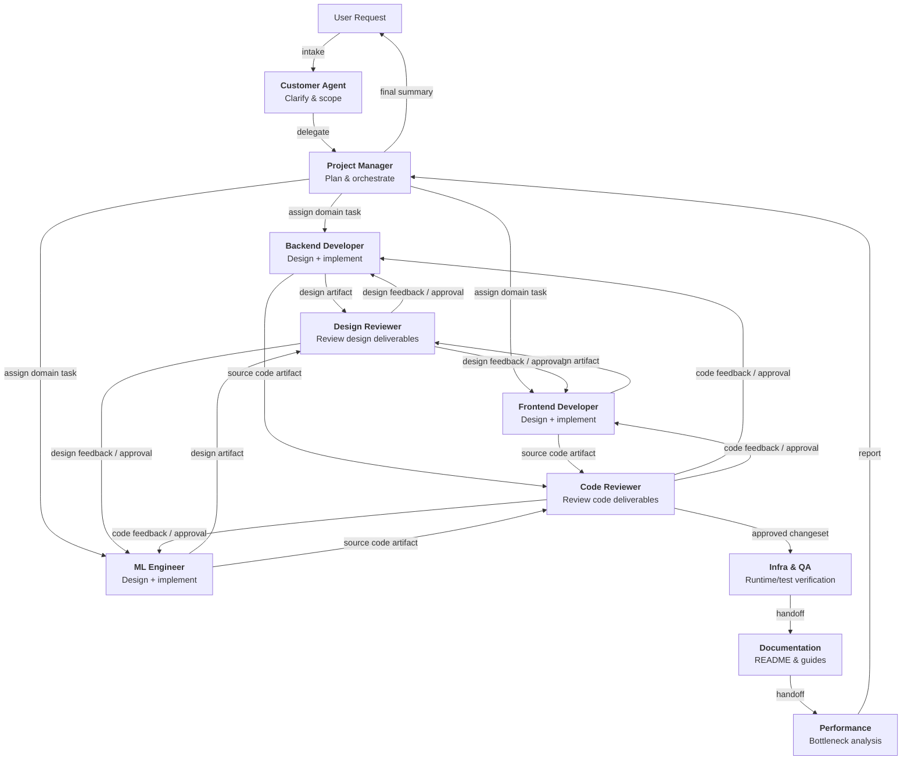

# copilot-assets

GitHub Copilot のエージェントオーケストレーションを標準化するための、マルチロール AI 開発ワークフレームです。

## 目次
- [概要](#概要)
- [アーキテクチャ](#アーキテクチャ)
- [エージェント](#エージェント)
- [スキル](#スキル)
- [導入ガイド](#導入ガイド)
- [ワークフロー例](#ワークフロー例)
- [開発](#開発)
- [ライセンス](#ライセンス)

---

## 概要

**目的**

このリポジトリは、GitHub Copilot のエージェントオーケストレーションを標準化し、チームが一貫性・監査性・再利用性のあるマルチエージェント開発ワークフローを実行できるようにすることを目的としています。

本フレームワークは次を重視します。

- **明確な責務分離**: 各専門エージェントが担当ドメインの作業をオーナーシップを持って担う
- **成果物駆動のレビュー**: 専門エージェントの成果物を明示的な成果物単位でレビューする
- **逐次的なトレーサビリティ**: タスク状態とハンドオフをタスク管理で統制する
- **移植性**: エージェントとスキルを他リポジトリに再利用しやすい形で設計する

**基本運用モデル**

1. Customer が要求を受け取り、明確化する
2. Project Manager が作業を分解し、担当を割り当てる
3. Backend Developer、Frontend Developer、ML Engineer がそれぞれ以下を作成する
   - 設計成果物
   - 実装成果物（ソースコード）
4. Design Reviewer が設計成果物をレビューする
5. Code Reviewer がソースコード成果物をレビューする
6. Infra & QA、Documentation、Performance が下流の検証と準備を完了する

この構成により、設計・実装の責任はドメイン担当に持たせつつ、品質ゲートは専任レビュアーが担うことができます。

---

## アーキテクチャ

### エージェントオーケストレーションフロー



### ディレクトリ構成

```text
copilot-assets/
├── agents/
│   ├── customer.agent.md
│   ├── project-manager.agent.md
│   ├── design-reviewer.agent.md
│   ├── backend-developer.agent.md
│   ├── frontend-developer.agent.md
│   ├── ml-engineer.agent.md
│   ├── infra-qa.agent.md
│   ├── code-reviewer.agent.md
│   ├── documentation.agent.md
│   └── performance.agent.md
├── skills/
│   ├── task-management/
│   │   └── SKILL.md
│   ├── git-operations/
│   │   └── SKILL.md
│   ├── design-review/
│   │   └── SKILL.md
│   ├── code-review/
│   │   └── SKILL.md
│   └── ...
└── README.md
```

---

## エージェント

各エージェントは `agents/*.agent.md` に定義され、スコープ・責務・制約・出力形式を明示しています。

### Customer Agent
- **利用場面**: 要求の受付と明確化
- **役割**: ユーザー意図を実装可能なタスクに変換する
- **制約**: 直接実装しない

### Project Manager Agent
- **利用場面**: 複数ドメインにまたがるオーケストレーションと順序制御
- **役割**: 担当割当、単一 `in_progress` の強制、`done_criteria` の検証
- **方針**: 依存関係とリスクに応じて順序を調整
- **代表的な実装順序**: Backend → Frontend → ML

### Backend Developer Agent
- **利用場面**: Backend/API/モデル変更
- **役割**: Backend の**設計と実装**を担当
- **主成果物**: Backend 設計成果物と Backend ソースコード

### Frontend Developer Agent
- **利用場面**: UI/Template/CSS/JS 変更
- **役割**: Frontend の**設計と実装**を担当
- **主成果物**: Frontend 設計成果物と Frontend ソースコード

### ML Engineer Agent
- **利用場面**: 学習/推論/データパイプライン変更
- **役割**: ML の**設計と実装**を担当
- **主成果物**: ML 設計成果物と ML ソースコード

### Design Reviewer Agent
- **利用場面**: Backend/Frontend/ML の設計成果物レビュー
- **役割**: design-review スキルを使って境界・契約・品質特性・実行準備性を評価
- **制約**: 機能実装は行わない

### Code Reviewer Agent
- **利用場面**: Backend/Frontend/ML のソースコード成果物をマージ前にレビュー
- **役割**: code-review スキルを使って正しさ・回帰リスク・セキュリティ・テスト妥当性を評価
- **制約**: 機能実装は行わない

### Infra & QA Agent
- **利用場面**: 環境、ランタイム、テスト戦略の検証
- **役割**: デプロイ/実行時前提とテスト実行可能性の検証

### Documentation Agent
- **利用場面**: README や開発ガイドの更新
- **役割**: 文書と実装の整合を保つ

### Performance Agent
- **利用場面**: ボトルネック分析と最適化
- **役割**: 計測可能な改善観点とトレードオフを提示

---

## スキル

スキルは `skills/*/SKILL.md` に定義された再利用可能な運用手順です。

### Task Management Skill
- タスク分解と担当割当
- 状態遷移（`todo`, `in_progress`, `blocked`, `done`）
- 単一 `in_progress` の強制

### Git Operations Skill
- 日常的な安全な Git 運用
- ブランチ運用、コミット衛生、同期、競合対応、ロールバック手順

### Design Review Skill
- アーキテクチャ/設計の品質チェック
- 重大度付き指摘と意思決定推奨

### Code Review Skill
- ソースコード品質とリリース安全性チェック
- 重大度付き指摘とマージ可否判定

---

## 導入ガイド

### クイックスタート: `.github` 配下に Git Submodule として追加

導入先リポジトリで次を実行します。

```bash
git submodule add https://github.com/ryoma-jp/copilot-assets.git .github
git submodule update --init --recursive
```

Submodule 追加後は、ワークスペース表示と設定反映のために VS Code を一度リロードしてください。

1. コマンドパレットを開く（`Ctrl+Shift+P`）
2. `Reload Window` で検索
3. `Developer: Reload Window` をクリック

### Nested Subagents の有効化（必須）

本フレームワークは以下の3階層のネストされたサブエージェント構成で動作します。

```
User → Customer (level 0) → Project Manager (level 1, subagent) → Specialists (level 2, sub-subagents)
```

VS Code のデフォルト設定では、サブエージェントが更にサブエージェントを呼び出すことはできません。  
導入先リポジトリの `.vscode/settings.json` に以下を追加してください。

```json
{
  "chat.subagents.allowInvocationsFromSubagents": true
}
```

この設定がない場合、Project Manager が Customer のサブエージェントとして動作中にスペシャリストエージェントを呼び出せません。

### エージェント呼び出しモデル

| エージェント | `user-invocable` | `disable-model-invocation` | 呼び出し元 |
|-------------|-----------------|---------------------------|-----------|
| customer | `true` | — | ユーザ（唯一の入口） |
| project-manager | `false` | — | customer（`agents` リスト経由） |
| backend-developer, frontend-developer, ml-engineer | `false` | `true` | project-manager（`agents` リストによる override） |
| design-reviewer, code-reviewer | `false` | `true` | project-manager（`agents` リストによる override） |
| infra-qa, documentation, performance | `false` | `true` | project-manager（`agents` リストによる override） |

`disable-model-invocation: true` はスペシャリストが任意のエージェントから呼び出されることを防ぎます。  
project-manager の `agents` 明示リストがこの制限を override し、制御された経路からのみアクセスを許可します。

### Submodule の更新

`copilot-assets` の最新の更新を取り込む場合は以下を実行します。

```bash
git submodule update --remote .github
git add .github
git commit -m "chore: update copilot-assets submodule"
```

### エージェントとスキルの参照先

Submodule のパスをそのまま参照します。

- Agents: `.github/agents/`
- Skills: `.github/skills/`

### 導入先の構成例

```text
your-project/
├── .github/
│   ├── agents/
│   ├── skills/
│   ├── README.md
│   ├── tasks/
│   │   ├── current.yaml
│   │   └── archive/
│   ├── copilot-instructions.md
│   └── CONVENTIONS.md
├── src/
└── ...
```

### `current.yaml` の運用ルール

- Project Manager は要件ごとに `current.yaml` を1つ作成する。
- 要件完了判定はルートの `completion_condition_for_requirement` のみを使用する。
- タスク完了判定は各タスクの `done_criteria` を使用する。
- すべてのタスクに、タスク単位ブランチ運用のため `branch_name` を必須で設定する。
- タスクを `in_progress` にする前に、`branch_name` のブランチを作成または切替すること。
- タスクを `done` にする前に、タスクブランチを `git merge --no-ff` で `main` へマージすること。マージコンフリクトが発生した場合は `status: blocked` にして `blockers` に詳細を記録する。
- 全タスク完了かつ要件完了条件を満たしたら `tasks/archive/` へ `current.yaml` を移送する。
- 新規要件ファイルを作成する際は `skills/task-management/current.template.yaml` を初期テンプレートとして利用する。

### `current.yaml` 項目一覧

#### ルート項目

| 項目 | 型 | 必須 | 説明 |
| --- | --- | --- | --- |
| `request_id` | string | yes | 要件を一意に識別するID。 |
| `requirement_summary` | string | yes | 要件の目的と範囲を簡潔に示す要約。 |
| `created_at` | string (ISO 8601) | yes | 要件ファイル作成日時。 |
| `updated_at` | string (ISO 8601) | yes | 要件ファイルの最終更新日時。 |
| `completion_condition_for_requirement` | array of string | yes | 要件全体の完了条件。ルートの完了キーはこれのみ使用する。 |
| `tasks` | array of object | yes | 逐次実行とハンドオフのためのタスク配列。 |

#### タスク項目 (`tasks[]`)

| 項目 | 型 | 必須 | 説明 |
| --- | --- | --- | --- |
| `task_id` | string | yes | 要件内で一意なタスクID。 |
| `title` | string | yes | タスク名。 |
| `owner` | string | yes | 実行責任を持つエージェント。 |
| `status` | enum | yes | タスク状態: `todo`, `in_progress`, `blocked`, `done`。 |
| `handoff_to` | string | yes | タスク完了後の次担当。 |
| `branch_name` | string | yes | タスク単位ブランチ開発に使うブランチ名。 |
| `inputs` | object | yes | タスク実行に必要な構造化入力（objective, scope, constraints, expected_output, acceptance）。 |
| `done_criteria` | array of string | yes | タスク完了判定に使う条件。 |
| `blockers` | object | yes | タスク進行を通常手順で継続できない状態を明示的に追跡するための情報。 |

#### ブロッカーの定義と項目

ブロッカーは単なる遅延ではなく、現時点の制約下で担当者が意味のある進捗を継続できない状態を指します。ブロッカーが存在し、直ちに有効な回避策がない場合は、タスク `status` を `blocked` に設定します。

| 項目 | 型 | 必須 | 説明 |
| --- | --- | --- | --- |
| `reason` | string | yes | ブロッカーの直接原因。例: 依存未解決、意思決定待ち、環境障害、権限不足。 |
| `impact` | string | yes | 何が進められないか、どの範囲に影響するか、遅延リスクを記述する。 |
| `workaround` | string | yes | 一時的に前進するための回避策。安全な回避策がない場合はその旨を明記する。 |
| `unblock_condition` | string | yes | 通常進行に戻すための客観的条件。例: 依存PRのマージ、方針承認、アクセス付与。 |

運用ガイド:
- 記述は抽象的な表現ではなく、事実ベースで実行可能な内容にする。
- 状態変更や新情報が出たらブロッカー項目を更新する。
- 解消時はブロッカー情報をクリアし、タスクを `in_progress` に戻す。

---

## ワークフロー例

**シナリオ**: 新規 API エンドポイント + UI + ML スコアリング更新

1. Customer が目的と受け入れ条件を定義する
2. Project Manager が Backend/Frontend/ML のドメインタスクを作成する
3. 各専門エージェントがドメインごとの設計成果物を作成する
4. Design Reviewer が各設計成果物をレビューし、指摘を返す
5. 設計承認後、各専門エージェントがソースコードを実装する
6. Code Reviewer が各コード成果物をレビューし、マージ準備可否を判定する
7. Infra & QA がランタイムとテスト戦略を検証する
8. Documentation が利用/設計ドキュメントを更新する
9. Performance がボトルネックと最適化案を評価する
10. Project Manager が完了条件を検証して最終報告する

---

## 開発

このフレームワークを拡張する場合:

1. `agents/` にスコープと制約が明確な新規エージェントを追加する
2. `skills/<skill-name>/SKILL.md` として新規スキルを追加する
3. task-management ポリシーと整合するようにオーケストレーションを維持する
4. 役割や構成を変更した場合は本 README を更新する

---

## ライセンス

詳細は [LICENSE](LICENSE) を参照してください。
