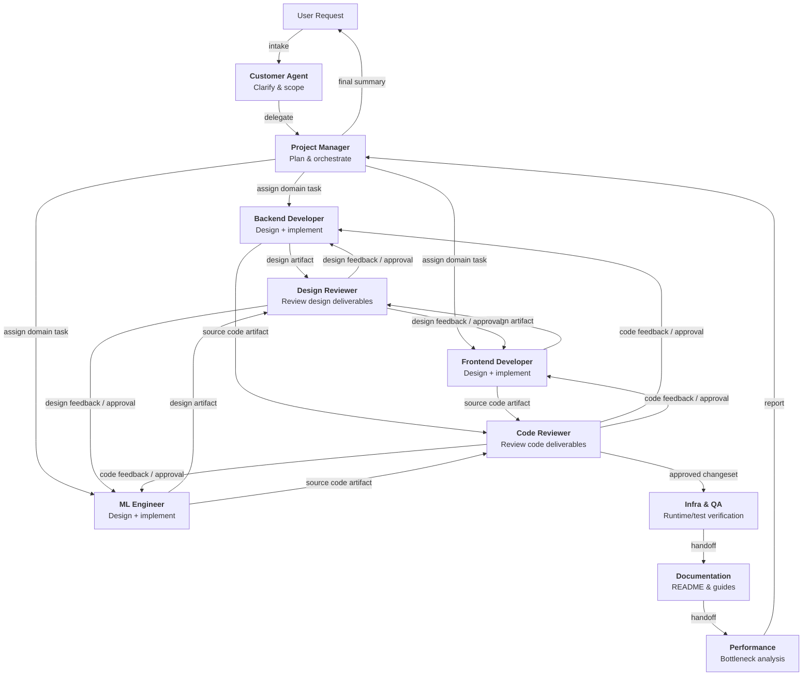

# copilot-assets

GitHub Copilot のエージェントオーケストレーションを標準化するための、マルチロール AI 開発ワークフレームです。

## 目次
- [概要](#概要)
- [アーキテクチャ](#アーキテクチャ)
- [エージェント](#エージェント)
- [スキル](#スキル)
- [導入ガイド](#導入ガイド)
- [ワークフロー例](#ワークフロー例)
- [開発](#開発)
- [ライセンス](#ライセンス)

---

## 概要

**目的**

このリポジトリは、GitHub Copilot のエージェントオーケストレーションを標準化し、チームが一貫性・監査性・再利用性のあるマルチエージェント開発ワークフローを実行できるようにすることを目的としています。

本フレームワークは次を重視します。

- **明確な責務分離**: 各専門エージェントが担当ドメインの作業をオーナーシップを持って担う
- **成果物駆動のレビュー**: 専門エージェントの成果物を明示的な成果物単位でレビューする
- **逐次的なトレーサビリティ**: タスク状態とハンドオフをタスク管理で統制する
- **移植性**: エージェントとスキルを他リポジトリに再利用しやすい形で設計する

**基本運用モデル**

1. Customer が要求を受け取り、明確化する
2. Project Manager が作業を分解し、担当を割り当てる
3. Backend Developer、Frontend Developer、ML Engineer がそれぞれ以下を作成する
   - 設計成果物
   - 実装成果物（ソースコード）
4. Design Reviewer が設計成果物をレビューする
5. Code Reviewer がソースコード成果物をレビューする
6. Infra & QA、Documentation、Performance が下流の検証と準備を完了する

この構成により、設計・実装の責任はドメイン担当に持たせつつ、品質ゲートは専任レビュアーが担うことができます。

---

## アーキテクチャ

### エージェントオーケストレーションフロー



### ディレクトリ構成

```text
copilot-assets/
├── agents/
│   ├── customer.agent.md
│   ├── project-manager.agent.md
│   ├── design-reviewer.agent.md
│   ├── backend-developer.agent.md
│   ├── frontend-developer.agent.md
│   ├── ml-engineer.agent.md
│   ├── infra-qa.agent.md
│   ├── code-reviewer.agent.md
│   ├── documentation.agent.md
│   └── performance.agent.md
├── skills/
│   ├── task-management/
│   │   └── SKILL.md
│   ├── git-operations/
│   │   └── SKILL.md
│   ├── design-review/
│   │   └── SKILL.md
│   ├── code-review/
│   │   └── SKILL.md
│   └── ...
└── README.md
```

---

## エージェント

各エージェントは `agents/*.agent.md` に定義され、スコープ・責務・制約・出力形式を明示しています。

### Customer Agent
- **利用場面**: 要求の受付と明確化
- **役割**: ユーザー意図を実装可能なタスクに変換する
- **制約**: 直接実装しない

### Project Manager Agent
- **利用場面**: 複数ドメインにまたがるオーケストレーションと順序制御
- **役割**: 担当割当、単一 `in_progress` の強制、`done_criteria` の検証
- **方針**: 依存関係とリスクに応じて順序を調整
- **代表的な実装順序**: Backend → Frontend → ML

### Backend Developer Agent
- **利用場面**: Backend/API/モデル変更
- **役割**: Backend の**設計と実装**を担当
- **主成果物**: Backend 設計成果物と Backend ソースコード

### Frontend Developer Agent
- **利用場面**: UI/Template/CSS/JS 変更
- **役割**: Frontend の**設計と実装**を担当
- **主成果物**: Frontend 設計成果物と Frontend ソースコード

### ML Engineer Agent
- **利用場面**: 学習/推論/データパイプライン変更
- **役割**: ML の**設計と実装**を担当
- **主成果物**: ML 設計成果物と ML ソースコード

### Design Reviewer Agent
- **利用場面**: Backend/Frontend/ML の設計成果物レビュー
- **役割**: design-review スキルを使って境界・契約・品質特性・実行準備性を評価
- **制約**: 機能実装は行わない

### Code Reviewer Agent
- **利用場面**: Backend/Frontend/ML のソースコード成果物をマージ前にレビュー
- **役割**: code-review スキルを使って正しさ・回帰リスク・セキュリティ・テスト妥当性を評価
- **制約**: 機能実装は行わない

### Infra & QA Agent
- **利用場面**: 環境、ランタイム、テスト戦略の検証
- **役割**: デプロイ/実行時前提とテスト実行可能性の検証

### Documentation Agent
- **利用場面**: README や開発ガイドの更新
- **役割**: 文書と実装の整合を保つ

### Performance Agent
- **利用場面**: ボトルネック分析と最適化
- **役割**: 計測可能な改善観点とトレードオフを提示

---

## スキル

スキルは `skills/*/SKILL.md` に定義された再利用可能な運用手順です。

### Task Management Skill
- タスク分解と担当割当
- 状態遷移（`todo`, `in_progress`, `blocked`, `done`）
- 単一 `in_progress` の強制

### Git Operations Skill
- 日常的な安全な Git 運用
- ブランチ運用、コミット衛生、同期、競合対応、ロールバック手順

### Design Review Skill
- アーキテクチャ/設計の品質チェック
- 重大度付き指摘と意思決定推奨

### Code Review Skill
- ソースコード品質とリリース安全性チェック
- 重大度付き指摘とマージ可否判定

---

## 導入ガイド

### クイックスタート: `.github` 配下に Git Submodule として追加

導入先リポジトリで次を実行します。

```bash
git submodule add https://github.com/your-org/copilot-assets.git .github
git submodule update --init --recursive
```

### エージェントとスキルの参照先

Submodule のパスをそのまま参照します。

- Agents: `.github/agents/`
- Skills: `.github/skills/`

### 導入先の構成例

```text
your-project/
├── .github/
│   ├── agents/
│   ├── skills/
│   ├── README.md
│   ├── tasks/
│   │   ├── current.md
│   │   └── archive/
│   ├── copilot-instructions.md
│   └── CONVENTIONS.md
├── src/
└── ...
```

---

## ワークフロー例

**シナリオ**: 新規 API エンドポイント + UI + ML スコアリング更新

1. Customer が目的と受け入れ条件を定義する
2. Project Manager が Backend/Frontend/ML のドメインタスクを作成する
3. 各専門エージェントがドメインごとの設計成果物を作成する
4. Design Reviewer が各設計成果物をレビューし、指摘を返す
5. 設計承認後、各専門エージェントがソースコードを実装する
6. Code Reviewer が各コード成果物をレビューし、マージ準備可否を判定する
7. Infra & QA がランタイムとテスト戦略を検証する
8. Documentation が利用/設計ドキュメントを更新する
9. Performance がボトルネックと最適化案を評価する
10. Project Manager が完了条件を検証して最終報告する

---

## 開発

このフレームワークを拡張する場合:

1. `agents/` にスコープと制約が明確な新規エージェントを追加する
2. `skills/<skill-name>/SKILL.md` として新規スキルを追加する
3. task-management ポリシーと整合するようにオーケストレーションを維持する
4. 役割や構成を変更した場合は本 README を更新する

---

## ライセンス

詳細は [LICENSE](LICENSE) を参照してください。
